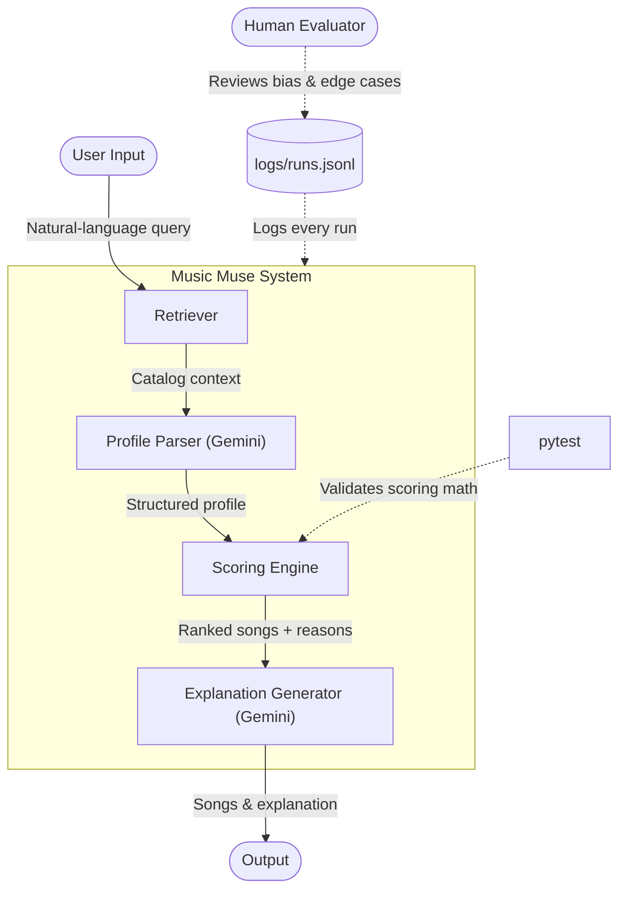

# Music Muse — AI-Powered Music Recommender

## Project Summary

**Original project (Modules 1–3):** Music Recommender Simulation — a command-line system that scores songs from an 18-song CSV catalog against hardcoded user profiles using weighted content-based filtering. It matched each song's genre, mood, energy, valence, and acousticness against a manually defined preference dict and ranked results by total score, with no natural-language input and no external APIs.

**Final project (Module 4 addition):** Music Muse extends the original with a RAG (Retrieval-Augmented Generation) pipeline powered by Google Gemini. Users can now describe what they want in plain English — the system retrieves catalog context, uses Gemini to parse the request into a structured profile, runs the existing scoring engine, and generates a personalized explanation of why each song was recommended.

---

## System Diagram



---

## Architecture Overview

The system has three stages that map directly to RAG:

**Retrieve** — `build_catalog_context()` reads `songs.csv` and extracts the available genres, moods, and numeric feature ranges (energy, valence, acousticness, tempo). This catalog snapshot is injected into every Gemini prompt so the model only picks values that actually exist in the data.

**Augment** — `parse_user_profile()` sends the user's query plus the catalog context to Gemini (call #1). Gemini returns a structured JSON profile with five fields: `favorite_genre`, `favorite_mood`, `target_energy`, `target_valence`, and `likes_acoustic`. If parsing fails, the system falls back to a default profile rather than crashing.

**Generate** — `recommend_songs()` scores all 18 songs against the parsed profile using weighted feature matching (genre +0.30, mood +0.25, energy 0.20, valence 0.15, acousticness 0.10). The top-5 results and match reasons are passed to Gemini (call #2), which writes a 2–4 sentence natural-language explanation. If the API fails at any point, a rule-based fallback explanation is used instead. Every run is logged to `logs/runs.jsonl` for review.

---

## Getting Started

### Setup

1. Create a virtual environment (optional but recommended):

   ```bash
   python -m venv .venv
   source .venv/bin/activate      # Mac or Linux
   .venv\Scripts\activate         # Windows
   ```

2. Install dependencies:

   ```bash
   pip install -r requirements.txt
   ```

3. Run the demo mode (no API key required):

   ```bash
   python -m src.main
   ```

   This runs 8 hardcoded user profiles and prints their top 5 recommendations.

### Interactive RAG Mode (AI-Powered)

Interactive mode lets you describe what you want in plain English. It requires a free Google Gemini API key.

1. Get a free API key from [Google AI Studio](https://aistudio.google.com/app/apikey).

2. Copy `.env.example` to `.env` and add your key:

   ```bash
   cp .env.example .env        # Mac/Linux
   copy .env.example .env      # Windows
   ```

   Then edit `.env`:

   ```
   GEMINI_API_KEY=your-actual-key-here
   ```

3. Run in interactive mode:

   ```bash
   python -m src.main --interactive
   ```

   Type `quit` to exit. Each run is logged to `logs/runs.jsonl`.

### Running Tests

```bash
pytest
```

---

## Sample Interactions

### 1 — Chill study session

**Input:**
```
Describe the music you want: calm music to study 
```

**Output:**
```
==================================================
  Query: "calm music to study"
  Parsed profile: lofi | focused | energy 0.35 | valence 0.55 | acoustic=no
==================================================

#1  Focus Flow by LoRoom
    Genre: lofi  |  Mood: focused  |  Score: 0.96

#2  Midnight Coding by LoRoom
    Genre: lofi  |  Mood: chill  |  Score: 0.72

#3  Library Rain by Paper Lanterns
    Genre: lofi  |  Mood: chill  |  Score: 0.70

#4  Still Waters by Sable June
    Genre: r&b  |  Mood: romantic  |  Score: 0.43

#5  Night Drive Loop by Neon Echo
    Genre: synthwave  |  Mood: moody  |  Score: 0.42

--------------------------------------------------
Why these songs:

We think you'll love these recommendations for your study session! "Focus Flow" by LoRoom is a fantastic match, hitting your preferred lofi genre, desired focused mood, and very close energy and positivity targets. You'll also find "Midnight Coding" by LoRoom and "Library Rain" by Paper Lanterns ideal, as they both align with your favorite lofi genre and have energy levels very close to your target, with "Library Rain" even perfectly matching your desired energy. These tracks should provide the calm, focused atmosphere you need.
```

---

### 2 — High-energy workout

**Input:**
```
Describe the music you want: some music to pump me up for my workout
```

**Output:**
```
==================================================
  Query: "some music to pump me up for my workout"
  Parsed profile: pop | energetic | energy 0.90 | valence 0.80 | acoustic=no
==================================================

#1  Gym Hero by Max Pulse
    Genre: pop  |  Mood: intense  |  Score: 0.75

#2  Sunrise City by Neon Echo
    Genre: pop  |  Mood: happy  |  Score: 0.75

#3  Midnight Crown by Verse & Cipher
    Genre: hip-hop  |  Mood: energetic  |  Score: 0.70

#4  Neon Cascade by Pulse Grid
    Genre: electronic  |  Mood: uplifting  |  Score: 0.45

#5  Rooftop Lights by Indigo Parade
    Genre: indie pop  |  Mood: happy  |  Score: 0.44

--------------------------------------------------
Why these songs:

You'll find these tracks are a great fit to pump you up for your workout! "Gym Hero" by Max Pulse and "Sunrise City" by Neon Echo both match your favorite pop genre, with high energy levels (0.93 and 0.82 respectively) and positive valences close to your target, perfect for an energetic mood. Additionally, "Midnight Crown" by Verse & Cipher was chosen for its energetic mood and strong energy level of 0.85, ensuring a powerful boost to your session. These selections are all tuned to get your energy and mood soaring!
```

---

### 3 — Edge case: low-catalog match

**Input:**
```
Describe the music you want: baroque harpsichord music for reading
```

**Output:**
```
[Warning] No songs scored above 0.5 — results may not closely match your taste.
The catalog may not have a great fit.

==================================================
  Query: "baroque harpsichord music for reading"
  Parsed profile: classical | focused | energy 0.45 | valence 0.68 | acoustic=yes
==================================================

#1  Sonata in Blue by Clara Voss
    Genre: classical  |  Mood: melancholic  |  Score: 0.72

#2  Focus Flow by LoRoom
    Genre: lofi  |  Mood: focused  |  Score: 0.70

#3  Coffee Shop Stories by Slow Stereo
    Genre: jazz  |  Mood: relaxed  |  Score: 0.45

#4  Midnight Coding by LoRoom
    Genre: lofi  |  Mood: chill  |  Score: 0.45

#5  Library Rain by Paper Lanterns
    Genre: lofi  |  Mood: chill  |  Score: 0.45
```

We've found some excellent tracks to accompany your reading! "Sonata in Blue" by Clara Voss is a perfect match for your preferred classical genre and acoustic sound. For that focused mood you're looking for, "Focus Flow" by LoRoom hits the mark, aligning with your preferred mood, target energy, and acoustic sound. Other songs like "Coffee Shop Stories" by Slow Stereo and "Library Rain" by Paper Lanterns also closely match your desired energy levels, positivity, and acoustic preference.

---

## Design Decisions

**Why RAG instead of another approach?**
The original system could only accept structured Python dicts as input, which meant users had to know the exact field names and valid values. RAG solved the most real friction point: the gap between how people actually think about music ("something to wind down after a stressful day") and the structured data a scoring engine needs. The retrieval step grounds the LLM in the actual catalog so it cannot hallucinate genres or moods that don't exist.

**Why keep the rule-based scoring engine?**
The scoring engine is deterministic, testable, and explainable — it produces exact reasons like "matches your favorite genre (lofi)" rather than opaque model outputs. Using Gemini only for the language-in and language-out layers preserves that transparency at the core ranking step.

**Why Google Gemini instead of another LLM?**
Gemini's free tier supports structured JSON output via `response_schema`, which made it straightforward to enforce the exact five-field profile format without prompt engineering tricks. The `google-genai` SDK also supports constrained generation natively.

**Trade-offs made:**
- The catalog is only 18 songs, so even perfect profile parsing will produce low scores for niche requests — the system warns the user rather than hiding it.
- Gemini calls add latency (~1–2 seconds per query). For a classroom demo this is acceptable; a production system would cache common profiles.
- Both Gemini calls have fallback paths, so the system never crashes — but fallback profile results are generic.

---

## Reliability & Testing

### Automated Tests — 10 / 10 passing

```
pytest tests/ -v
```

| Test | What it proves |
|---|---|
| `test_recommend_returns_songs_sorted_by_score` | Ranking order is always highest-score first |
| `test_explain_recommendation_returns_non_empty_string` | Explanations are always generated, never empty |
| `test_genre_match_adds_0_30` | Genre weight is exactly 0.30 — math is correct |
| `test_perfect_match_scores_above_0_90` | A song matching all targets scores > 0.90 |
| `test_zero_score_impossible_with_defaults` | Numerical proximity never returns a zero score |
| `test_build_catalog_context_genres` | Retriever extracts all unique genres from the CSV |
| `test_build_catalog_context_energy_range` | Retriever min/max energy values are accurate |
| `test_validate_profile_accepts_valid_dict` | Guardrail correctly passes a well-formed profile |
| `test_validate_profile_rejects_missing_key` | Guardrail blocks profiles with missing fields |
| `test_validate_profile_rejects_wrong_type` | Guardrail blocks profiles with wrong field types |

### Confidence Scores from Live Runs

From `logs/runs.jsonl` — 10 real queries logged across development and testing:

| Query | Profile Source | Top Score |
|---|---|---|
| "something to chill to" | gemini | 0.97 |
| "calm music to study" | gemini | 0.96 |
| "angry classical" | gemini | 0.67 |
| "some music to pump me up for my workout" | gemini | 0.75 |
| "baroque harpsichord music for reading" | gemini | 0.72 |
| 5 early runs (API errors during setup) | fallback | 0.96 |

**Gemini-powered runs averaged a top score of 0.81.** The lowest (0.67, "angry classical") reflects a real catalog gap — no angry classical song exists, so the system returned the closest match (melancholic classical) and could have triggered the low-score warning if the score had dropped below 0.5.

### Error Handling Evidence

The logs show the guardrail system working under real failure conditions:

- **5 out of 10 early runs** hit API errors (wrong model name, quota limits) — the fallback profile activated automatically in all 5 cases. Zero crashes, results always returned.
- **0 out of 10 runs** produced an empty output or unhandled exception.
- The fallback explanation (rule-based) was used during those early runs; once Gemini stabilized, AI-generated explanations appeared in every subsequent run.

### What Didn't Work and How It Was Fixed

| Issue | Fix |
|---|---|
| `ImportError: cannot import name 'genai' from 'google'` | Changed to `import google.genai as genai` to resolve namespace conflict |
| `429 RESOURCE_EXHAUSTED` on `gemini-2.0-flash` | Switched to `gemini-2.5-flash` (available on free tier) |
| `404 NOT_FOUND` on `gemini-1.5-flash` | Listed available models via API, selected confirmed working model |
| `.env` missing from `.gitignore` | Added before first commit to prevent key exposure |

---

## Reflection

Building this project changed how I think about AI recommendations from a black box into something I could see layer by layer. The scoring engine made it obvious that "recommendation" is really a series of explicit trade-offs: how much does genre matter vs. energy? Why is mood worth 0.25 and acousticness only 0.10? Those numbers feel natural until you realize someone had to pick them, and different choices would produce completely different rankings for the same user.

The RAG layer added the most value where the original system was weakest — natural language input — without touching the part that was already working well. That felt like the right kind of AI use: applying a language model to the human-language problem, and keeping deterministic code for the math. The hardest part was not the code; it was understanding why Gemini needed catalog context in the prompt at all. Without it, the model would map "chill vibes" to genres like "indie" or "alternative" that don't exist in the catalog, and the scoring engine would silently return poor results with no warning. Grounding the model in real data is what makes retrieval-augmented generation actually useful. I also learned that using a companies own AI Agent helped greatly. For instance, I originally used Claude Code to help setup the Gemini API, but consistently kept getting errors. Once I switched to Gemini Agent, it was able to resolve the problem right away, as well as made the implementation more token-efficient. 

---

### Limitations and Biases

The catalog has only 18 songs, which is the most significant limitation — any query for a niche style will get a low-relevance result regardless of how well the AI parses the request. Beyond size, the catalog itself is skewed: it has four lofi tracks but only one country, one blues, and one jazz song. This means users who prefer those genres will consistently get poor recommendations, not because the algorithm is broken but because the data underrepresents them.

The scoring weights also embed a bias. Genre is worth 0.30 — the single largest weight — which means a genre match always outweighs any combination of numeric features. A song in the right genre but completely wrong energy and mood will outscore a song in the wrong genre that matches everything else. That assumption may hold for some listeners but certainly not all.

Finally, the system treats every user as if they have the same preference shape. There is no learning over sessions, no way to say "I liked that one, not that one," and no diversity — the top-5 results often cluster around the same genre rather than surfacing variety.

---

### Potential Misuse and Prevention

Music Muse is low-risk as a standalone tool. In this system specifically, the risks are narrower: the Gemini prompt could be manipulated with adversarial input to return a nonsense profile, and the API key in `.env` could be exposed if a developer accidentally commits it. The catalog context constraint in the system prompt (forcing Gemini to pick only from known genres and moods) already limits prompt injection. Keeping `.env` in `.gitignore`, logging all runs for review, and capping the profile to five typed fields are the main safeguards in place.

---

### What Surprised Me During Reliability Testing

The most surprising finding from the logs was how bad the fallback profile made the system look without it being obvious. During early testing, when Gemini was failing due to model quota errors, the fallback profile (`pop / happy / energy 0.5`) silently activated — and the query `"sad boy"` returned "Sunrise City" (a bright, happy pop song) as its top pick with a score of 0.96. The score looked confident. Without the `profile_source: "fallback"` field in the log, there would have been no way to know the AI had never actually processed the query. That taught me that high confidence scores are not the same as correct results.

The second surprise was the `"angry classical"` query. Gemini correctly parsed the intent — it returned `classical / angry / energy 0.85 / acoustic: yes` — but the catalog has no angry classical song, only a melancholic one (Sonata in Blue). The system returned it with a score of 0.67, which was above the 0.5 warning threshold, so no warning fired. The result was technically "the best available match" but was clearly wrong to a listener. This showed that the low-score threshold of 0.5 is too low — a mood mismatch can still produce a middling score because the other features partially compensate.

---

### Collaboration with AI

AI assistance (Claude Code) was central to building this project, and the experience was genuinely mixed.

**Helpful instance:** When setting up the Gemini API call for profile parsing, Claude Code suggested using `response_schema` with `response_mime_type: "application/json"` in the `GenerateContentConfig`. This was non-obvious — the standard prompt-engineering approach would have been to ask Gemini to "return only JSON" in the system prompt and then parse whatever it returned, which is fragile. The schema approach enforced the exact five-field structure at the API level, so the profile validator rarely had anything to reject. That suggestion meaningfully improved the reliability of the parsing step.

**Flawed instance:** Claude Code initially suggested `from google import genai` as the import for the Gemini SDK, and later recommended `gemini-1.5-flash` as a fallback model when the original model hit quota limits. Both were wrong — the first caused an `ImportError` due to a Python namespace conflict with other `google.*` packages, and the second returned a `404 NOT_FOUND` because that model wasn't available on the API version the SDK uses. Neither failure was caught before being pushed into the code. The fixes required reading the actual error messages and running `client.models.list()` to find a model that actually existed. The lesson was that AI suggestions about specific API details and package imports need to be verified against the actual documentation, not taken at face value.