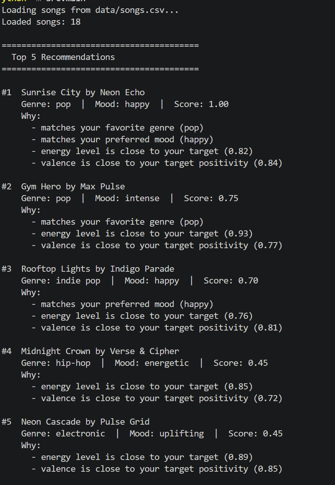
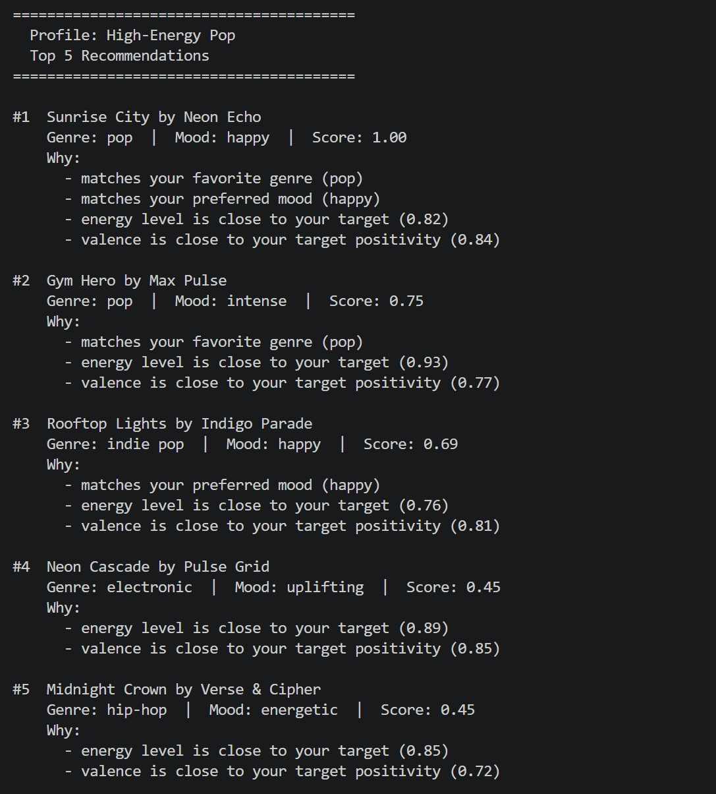
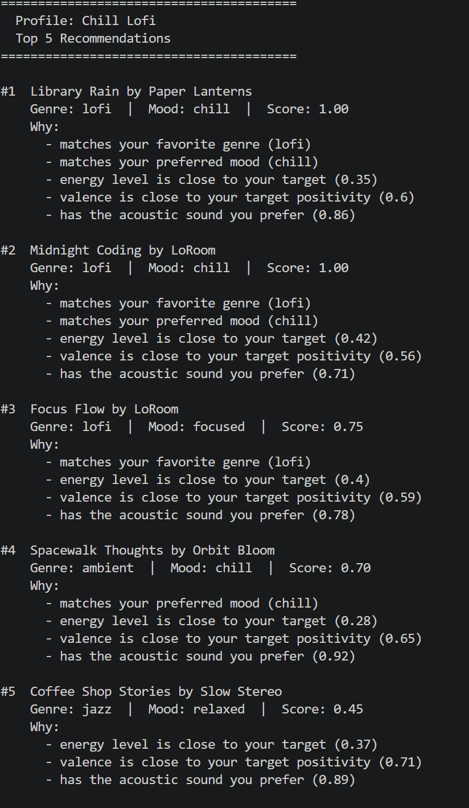
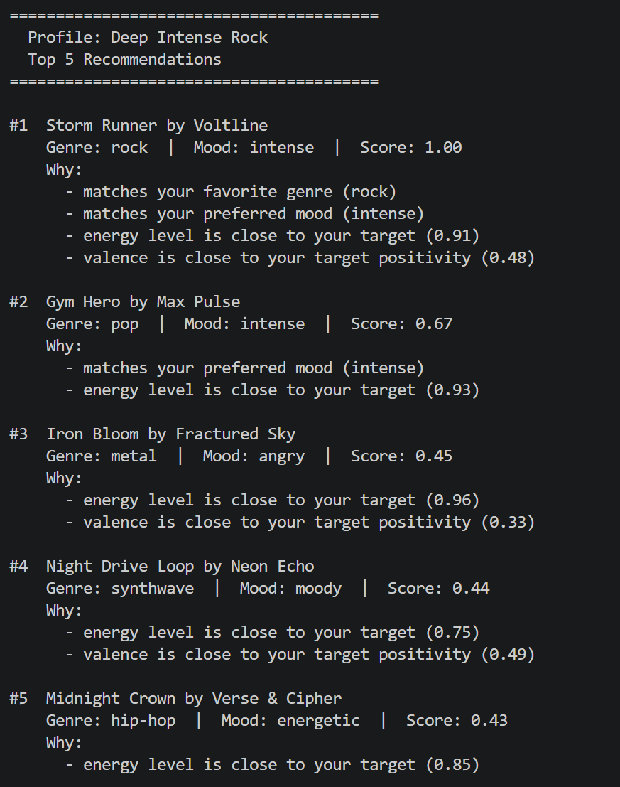
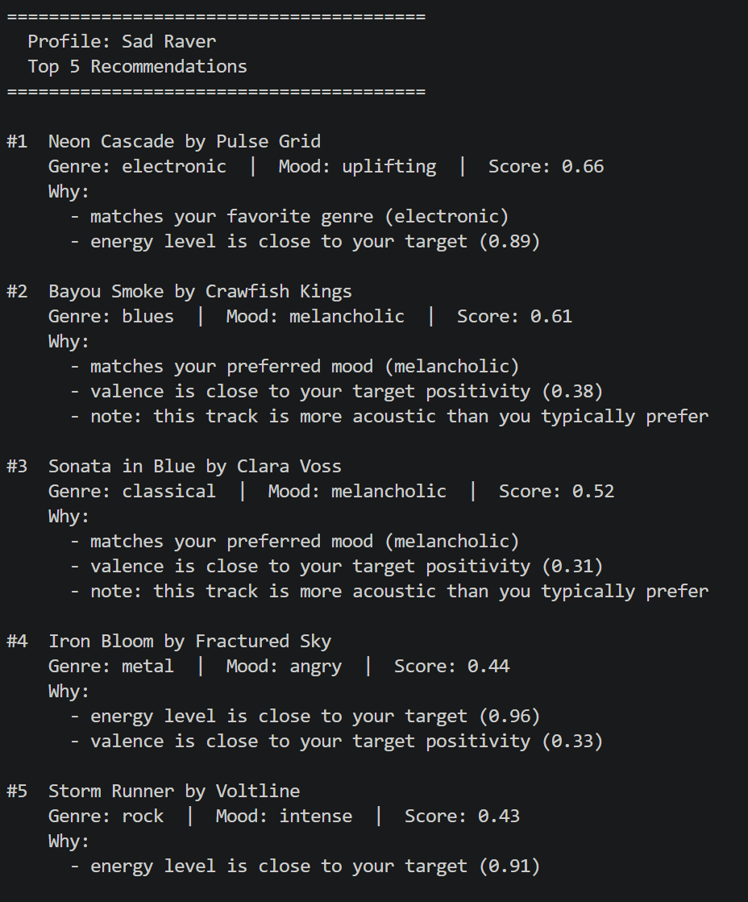
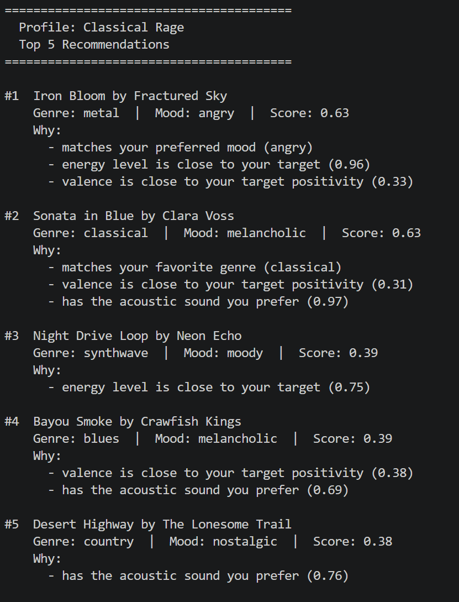
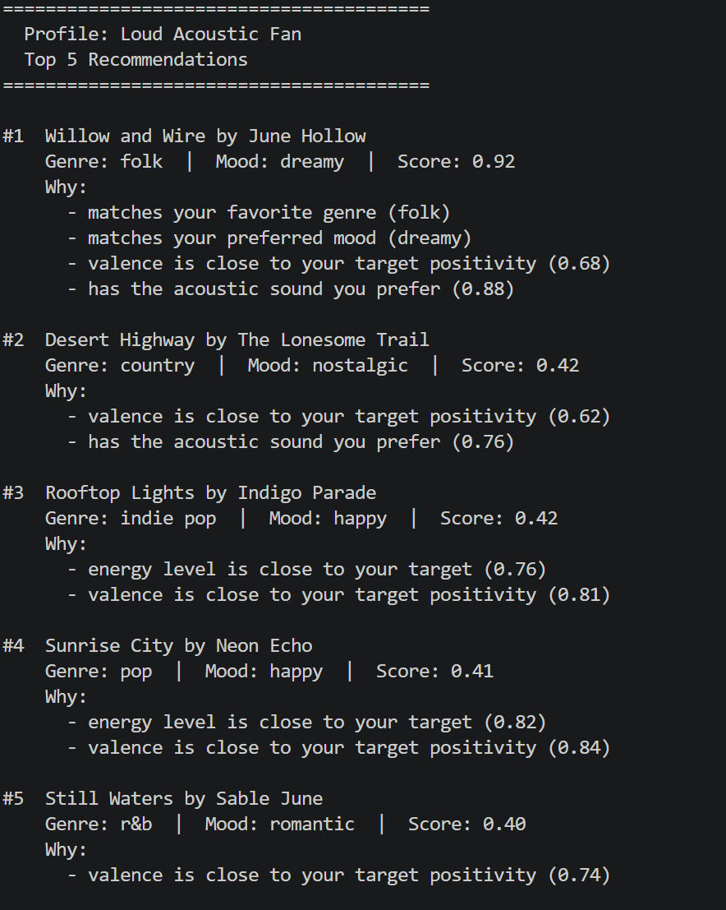
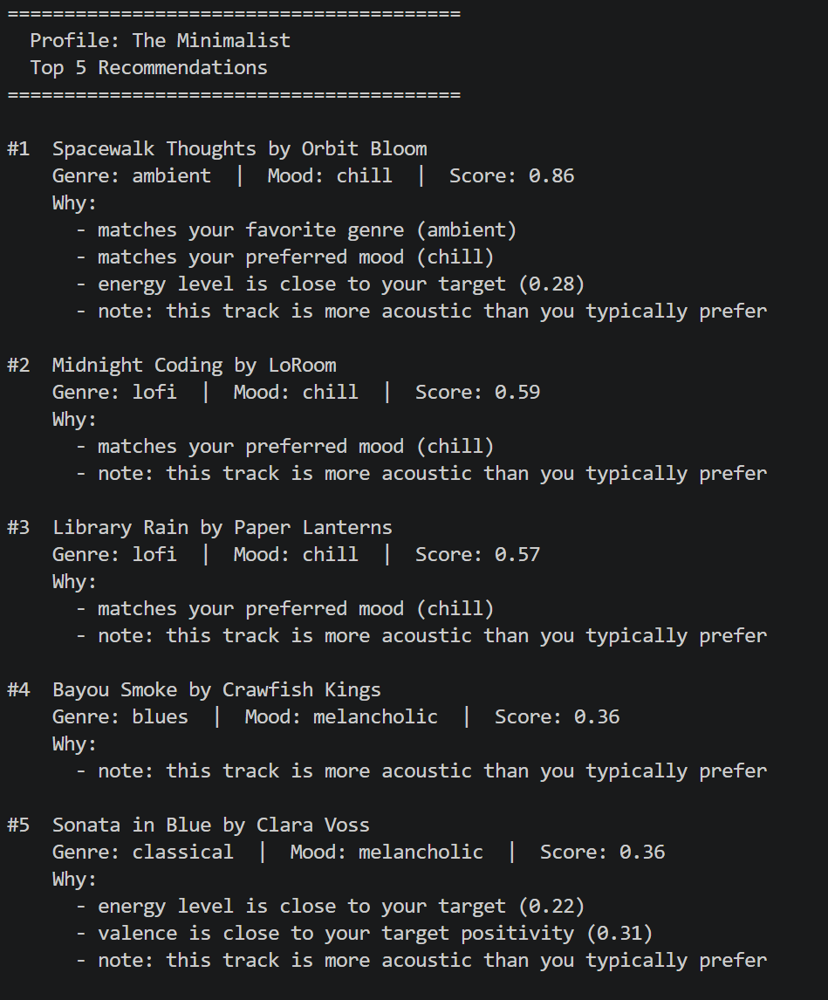
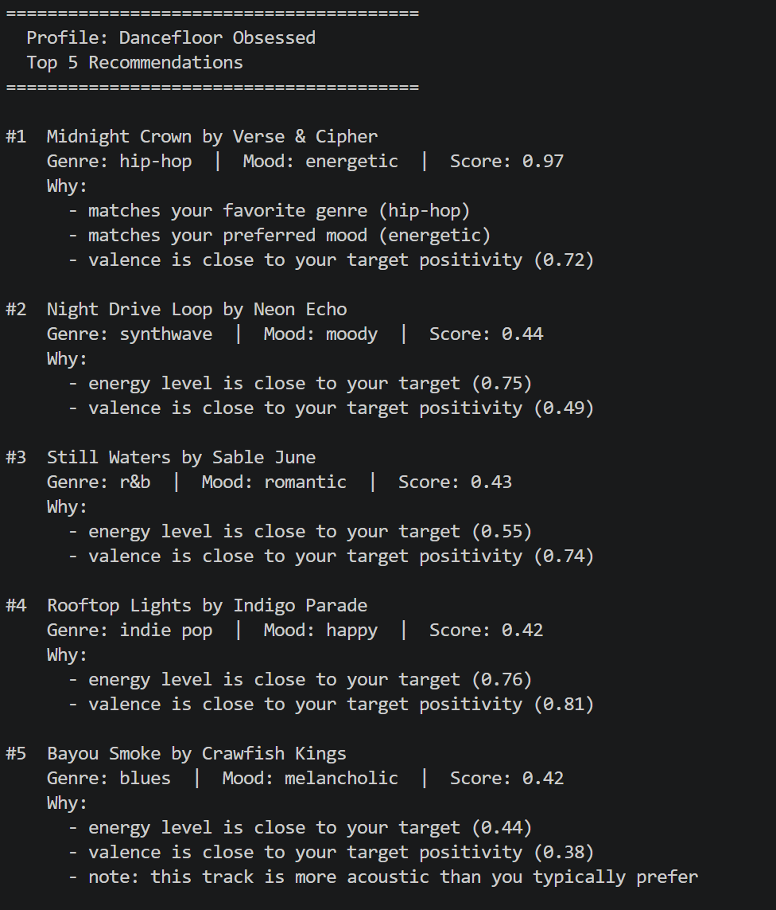

# 🎵 Music Recommender Simulation

## Project Summary

In this project you will build and explain a small music recommender system.

Your goal is to:

- Represent songs and a user "taste profile" as data
- Design a scoring rule that turns that data into recommendations
- Evaluate what your system gets right and wrong
- Reflect on how this mirrors real world AI recommenders

Replace this paragraph with your own summary of what your version does.


---

## How The System Works

**Approach:** Content-based filtering — each song is scored against the user's taste profile and ranked by total score.

**Song Features Used:**
- `genre` and `mood` — categorical labels; strongest taste filters in the dataset
- `energy` — how intense or active the track feels (0.0–1.0); highest numeric weight
- `acousticness` — how organic vs. electronic the track sounds (0.0–1.0)
- `valence` — emotional positivity, dark to bright (0.0–1.0)
- `danceability` — rhythmic suitability; used as a supporting tiebreaker

**UserProfile Stores:**
- `favorite_genre` — preferred musical style
- `favorite_mood` — preferred emotional character
- `target_energy` — desired intensity level (0.0–1.0)
- `likes_acoustic` — preference for organic vs. electronic sound (True/False)

**Scoring Rule (one song at a time):**
- Categorical match: `genre` match → +0.30, `mood` match → +0.25
- Numerical proximity: `score = 1 - (song_value - user_target)²`
  - Squaring the difference lightly penalizes small gaps, heavily penalizes large ones
  - `energy` weighted 0.20, `acousticness` 0.15, `valence` 0.10
- All weighted components sum to a final score between 0.0 and 1.0

**Ranking Rule (choosing what to recommend):**
- Score every song in the catalog using the scoring rule above
- Sort all songs by score, highest first
- Return the top `k` results (default: 5)

**Mermaid.js Flowchart:**
flowchart TD
    A([User Preferences\ngenre · mood · energy · acoustic]) --> B[Load songs from CSV]
    B --> C{More songs\nto score?}
    C -- Yes --> D[Score next song\ngenre match +2.0\nmood match +1.0\nenergy proximity]
    D --> E[Append score\nto results list]
    E --> C
    C -- No --> F[Sort all songs\nby score descending]
    F --> G[Slice top K]
    G --> H([Top K Recommendations])

**Potential Biases**
- Genres are over-prioritzed. it assumes genre is always the dominant signal, which isn't always true. 
- Energy is the only numerical feature being taken into account, which can rank 2 songs with different tempo and danceability.

**Phase 3 Step 4 CLI Verification** 



**Three distinct user dictionaries**




**Edge-Cases**







---

## Getting Started

### Setup

1. Create a virtual environment (optional but recommended):

   ```bash
   python -m venv .venv
   source .venv/bin/activate      # Mac or Linux
   .venv\Scripts\activate         # Windows
   ```

2. Install dependencies:

   ```bash
   pip install -r requirements.txt
   ```

3. Run the demo mode (no API key required):

   ```bash
   python -m src.main
   ```

   This runs 8 hardcoded user profiles and prints their top 5 recommendations.

### Interactive RAG Mode (AI-Powered)

Interactive mode lets you describe what you want in plain English. It requires a free Google Gemini API key.

1. Get a free API key from [Google AI Studio](https://aistudio.google.com/app/apikey).

2. Copy `.env.example` to `.env` and add your key:

   ```bash
   cp .env.example .env        # Mac/Linux
   copy .env.example .env      # Windows
   ```

   Then edit `.env`:

   ```
   GEMINI_API_KEY=your-actual-key-here
   ```

3. Run in interactive mode:

   ```bash
   python -m src.main --interactive
   ```

   Example session:

   ```
   Describe the music you want: something chill for studying late at night
   Analyzing your preferences...
   Generating explanation...
   #1  Lo-Fi Dreams by ChillBeats   Genre: lofi  |  Mood: chill  |  Score: 0.87
   ...
   ```

   Type `quit` to exit. Each run is logged to `logs/runs.jsonl`.

### Running Tests

Run the starter tests with:

```bash
pytest
```

You can add more tests in `tests/test_recommender.py`.

---

## Experiments You Tried

Use this section to document the experiments you ran. For example:

- What happened when you changed the weight on genre from 2.0 to 0.5
- What happened when you added tempo or valence to the score
- How did your system behave for different types of users

---

## Limitations and Risks

Summarize some limitations of your recommender.

Examples:

- It only works on a tiny catalog
- It does not understand lyrics or language
- It might over favor one genre or mood

You will go deeper on this in your model card.

---

## Reflection

Read and complete `model_card.md`:

[**Model Card**](model_card.md)

Write 1 to 2 paragraphs here about what you learned:

- about how recommenders turn data into predictions
- about where bias or unfairness could show up in systems like this


---

## 7. `model_card_template.md`

Combines reflection and model card framing from the Module 3 guidance. :contentReference[oaicite:2]{index=2}  

```markdown
# 🎧 Model Card - Music Recommender Simulation

## 1. Model Name

Give your recommender a name, for example:

> VibeFinder 1.0

---

## 2. Intended Use

- What is this system trying to do
- Who is it for

Example:

> This model suggests 3 to 5 songs from a small catalog based on a user's preferred genre, mood, and energy level. It is for classroom exploration only, not for real users.

---

## 3. How It Works (Short Explanation)

Describe your scoring logic in plain language.

- What features of each song does it consider
- What information about the user does it use
- How does it turn those into a number

Try to avoid code in this section, treat it like an explanation to a non programmer.

---

## 4. Data

Describe your dataset.

- How many songs are in `data/songs.csv`
- Did you add or remove any songs
- What kinds of genres or moods are represented
- Whose taste does this data mostly reflect

---

## 5. Strengths

Where does your recommender work well

You can think about:
- Situations where the top results "felt right"
- Particular user profiles it served well
- Simplicity or transparency benefits

---

## 6. Limitations and Bias

Where does your recommender struggle

Some prompts:
- Does it ignore some genres or moods
- Does it treat all users as if they have the same taste shape
- Is it biased toward high energy or one genre by default
- How could this be unfair if used in a real product

---

## 7. Evaluation

How did you check your system

Examples:
- You tried multiple user profiles and wrote down whether the results matched your expectations
- You compared your simulation to what a real app like Spotify or YouTube tends to recommend
- You wrote tests for your scoring logic

You do not need a numeric metric, but if you used one, explain what it measures.

---

## 8. Future Work

If you had more time, how would you improve this recommender

Examples:

- Add support for multiple users and "group vibe" recommendations
- Balance diversity of songs instead of always picking the closest match
- Use more features, like tempo ranges or lyric themes

---

## 9. Personal Reflection

A few sentences about what you learned:

- What surprised you about how your system behaved
- How did building this change how you think about real music recommenders
- Where do you think human judgment still matters, even if the model seems "smart"
